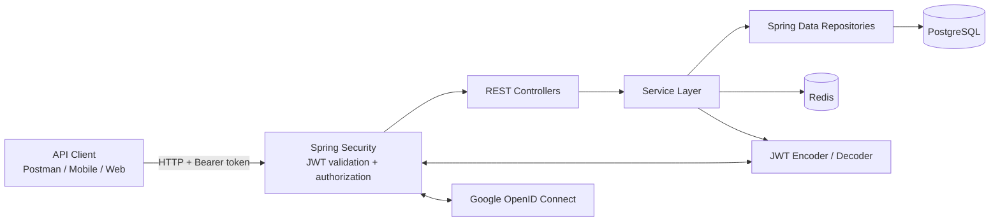
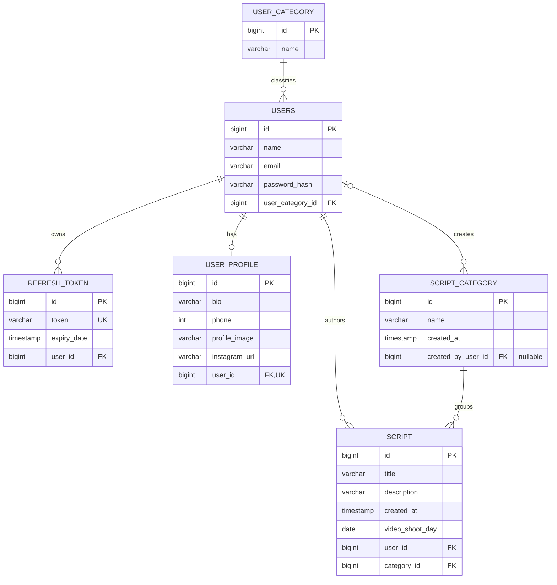
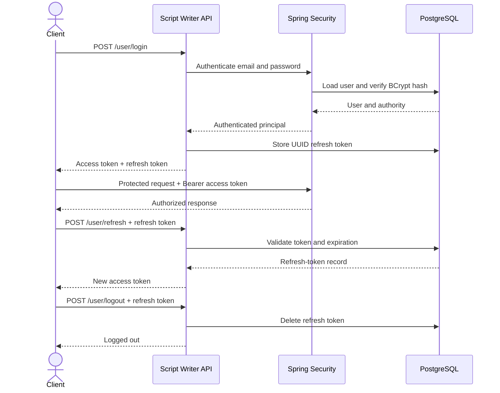

<div align="center">

# Script Writer Backend

### Secure REST API foundation for planning, organizing, and managing video scripts

[](https://openjdk.org/)
[](https://spring.io/projects/spring-boot)
[](https://www.postgresql.org/)
[](#security-model)
[](LICENSE)

[](https://github.com/shiv10000/Script-Writer-Backend/stargazers)
[](https://github.com/shiv10000/Script-Writer-Backend/network/members)
[](https://github.com/shiv10000/Script-Writer-Backend/issues)

**Backend only · Stateless authentication · Work in progress**

</div>

---

## About the project

Script Writer Backend is a Spring Boot REST API for a script-planning platform. It provides a secure foundation for user accounts, role-based authorization, persistent refresh tokens, user categories, scripts, script categories, and creator profiles.

The project is currently focused entirely on backend development. Authentication and the core user-security workflow are implemented, while several script-management features are represented in the data model and are still awaiting API and service implementations.

> [!IMPORTANT]
> This repository is under active development. The implemented and planned capabilities are separated below so the documentation does not promise unfinished behavior.

## Current capabilities

### Implemented

- User registration and username/password login
- BCrypt password hashing with strength `12`
- Stateless Spring Security configuration
- HS256-signed JWT access tokens
- Database-backed refresh tokens with configurable expiration
- Access-token renewal and refresh-token revocation on logout
- `USER` and `ADMIN` authority-based access control
- Optional, environment-driven initial admin bootstrap
- Authenticated user CRUD operations
- Authenticated user-category CRUD operations
- Admin-only user promotion endpoint
- Centralized JSON error responses
- Request and service-performance logging
- PostgreSQL persistence through Spring Data JPA
- Environment-based secret and database configuration
- Redis-backed, time-limited email verification codes
- Google OpenID Connect sign-in with verified-email validation

### Modeled but not yet exposed through APIs

- Script creation and management
- Script-category management
- User-profile management
- Script scheduling through `videoShootDay`

## Tech stack

| Area | Technology |
| --- | --- |
| Language | Java 25 |
| Framework | Spring Boot 4.1.0 |
| Web | Spring Web MVC |
| Authentication | Spring Security + OAuth2 Resource Server |
| Social sign-in | Spring Security OAuth2 Client + Google OpenID Connect |
| Tokens | Nimbus JOSE JWT, HS256 |
| Persistence | Spring Data JPA / Hibernate |
| Database | PostgreSQL |
| Temporary data | Redis |
| Password hashing | BCrypt |
| Build | Maven Wrapper |
| Boilerplate reduction | Lombok |
| Testing | JUnit 5 + Spring Boot Test |

## Architecture



The API follows a conventional layered structure: controllers define the HTTP contract, services contain business rules, repositories provide persistence, and Spring Security validates every protected request before it reaches a controller.

## Database model

The following diagram is derived directly from the JPA entities in `src/main/java/org/shivam/script_writer/entity`.



### Relationship summary

- Every user belongs to one user category, such as `USER` or `ADMIN`.
- A user can author many scripts.
- Every script belongs to exactly one script category.
- A user can optionally have one profile.
- A user can own multiple refresh tokens across login sessions.
- A script category may optionally record the user who created it.

## Security model



### Authorization rules

| Route | Access |
| --- | --- |
| `/user/register` | Public |
| `/user/login` | Public |
| `/user/refresh` | Public, requires a valid refresh token in the body |
| `/user/logout` | Public, revokes the supplied refresh token |
| `/oauth2/authorization/google` | Public, starts Google sign-in |
| `/login/oauth2/code/google` | Public, OAuth2 callback handled by Spring Security |
| `/oauth/profile` | Requires an `OIDC_USER` authority from a Google sign-in session |
| `/admin/**` | Requires the `ADMIN` authority |
| All other routes | Requires a valid JWT access token |

Protected requests must include:

```http
Authorization: Bearer <access-token>
```

## API reference

Base URL during local development:

```text
http://localhost:8080
```

### Authentication

| Method | Endpoint | Description | Access |
| --- | --- | --- | --- |
| `POST` | `/user/register` | Register a user with the default `USER` authority | Public |
| `POST` | `/user/login` | Authenticate and receive access and refresh tokens | Public |
| `POST` | `/user/refresh` | Exchange a valid refresh token for a new access token | Public |
| `POST` | `/user/logout` | Revoke a refresh token | Public |
| `GET` | `/oauth2/authorization/google` | Start Google OpenID Connect sign-in | Public |
| `GET` | `/oauth/profile` | Return the signed-in Google profile | Google OIDC session |

### Users

| Method | Endpoint | Description | Access |
| --- | --- | --- | --- |
| `GET` | `/user/user` | List users | Authenticated |
| `GET` | `/user/user/{id}` | Get a user by ID | Authenticated |
| `PUT` | `/user/user/{id}` | Update a user | Authenticated |
| `DELETE` | `/user/user/{id}` | Delete a user | Authenticated |
| `PATCH` | `/admin/users/{id}/promote` | Promote a user to `ADMIN` | Admin only |

### User categories

| Method | Endpoint | Description | Access |
| --- | --- | --- | --- |
| `POST` | `/user/category` | Create a user category | Authenticated |
| `GET` | `/user/category` | List user categories | Authenticated |
| `GET` | `/user/category/{id}` | Get a category by ID | Authenticated |
| `PUT` | `/user/category/{id}` | Update a category | Authenticated |
| `DELETE` | `/user/category` | Delete a category by name | Authenticated |

## Authentication examples

### Register

```bash
curl -X POST http://localhost:8080/user/register \
  -H "Content-Type: application/json" \
  -d '{
    "name": "demo-user",
    "email": "demo@example.com",
    "password": "choose-a-strong-password"
  }'
```

### Login

```bash
curl -X POST http://localhost:8080/user/login \
  -H "Content-Type: application/json" \
  -d '{
    "email": "demo@example.com",
    "password": "choose-a-strong-password"
  }'
```

Example response:

```json
{
  "accessToken": "eyJhbGciOiJIUzI1NiJ9...",
  "refreshToken": "2cb6f4d5-5d2b-4b95-8a09-ec89dba8edcf",
  "tokenType": "Bearer"
}
```

### Refresh an access token

```bash
curl -X POST http://localhost:8080/user/refresh \
  -H "Content-Type: application/json" \
  -d '{"refreshToken":"<your-refresh-token>"}'
```

### Call a protected endpoint

```bash
curl http://localhost:8080/user/user \
  -H "Authorization: Bearer <your-access-token>"
```

## Redis email verification

Redis stores the six-digit verification code created when a user registers or tries to log in with an unverified account. Codes are keyed by email address, expire after 3,000 seconds (50 minutes), and are deleted after successful verification.

Redis is configured with `REDIS_HOST` and `REDIS_PORT` (defaulting to `localhost:6379`). Start Redis before running the API; for example, with Docker:

```bash
docker run --name script-writer-redis -p 6379:6379 redis:7-alpine
```

To verify an account, submit the code sent by email:

```bash
curl -X POST http://localhost:8080/user/verify \
  -H "Content-Type: application/json" \
  -d '{"email":"demo@example.com","code":"123456"}'
```

## Google sign-in

Google sign-in uses OpenID Connect. Configure an OAuth 2.0 Web application in Google Cloud and add this authorized redirect URI:

```text
http://localhost:8080/login/oauth2/code/google
```

Set the client credentials in `.env`:

```dotenv
GOOGLE_CLIENT_ID=your_google_oauth_client_id
GOOGLE_CLIENT_SECRET=your_google_oauth_client_secret
```

Then open `http://localhost:8080/oauth2/authorization/google` in a browser. On a successful Google sign-in, the application accepts only identities with a subject, email address, and verified email. It creates a local `USER` account for a new Google identity. If a password-based account already uses that email address, sign-in is rejected rather than automatically linking the accounts.

Google sign-in establishes Spring Security's OAuth2 session; it does not issue this API's JWT/refresh-token pair. While that session is active, `GET /oauth/profile` returns the Google subject, name, email, and email-verification status.

## Getting started

### Prerequisites

- Java 25
- PostgreSQL
- Redis
- Git
- OpenSSL, or another way to generate a strong Base64 secret

Maven does not need to be installed globally because the repository includes the Maven Wrapper.

### 1. Clone the repository

```bash
git clone https://github.com/shiv10000/Script-Writer-Backend.git
cd Script-Writer-Backend
```

### 2. Create the database

```sql
CREATE DATABASE company_db;
```

Hibernate currently uses `ddl-auto=update`, so the tables are created or updated when the application starts.

### 3. Configure local environment variables

Create your private `.env` file from the committed example:

```bash
cp .env.example .env
```

Generate a JWT signing key:

```bash
openssl rand -base64 32
```

Then update `.env`:

```dotenv
DB_URL=jdbc:postgresql://localhost:5432/company_db
DB_USERNAME=your_postgres_username
DB_PASSWORD=your_postgres_password
JWT_SECRET=your_generated_base64_secret
REDIS_HOST=localhost
REDIS_PORT=6379
GOOGLE_CLIENT_ID=your_google_oauth_client_id
GOOGLE_CLIENT_SECRET=your_google_oauth_client_secret
```

The `.env` file is ignored by Git. Never commit real database credentials, JWT secrets, access tokens, or refresh tokens.

### 4. Run the API

macOS/Linux:

```bash
./mvnw spring-boot:run
```

Windows:

```powershell
.\mvnw.cmd spring-boot:run
```

## Optional admin bootstrap

The application can create the first admin account at startup. This behavior is disabled by default.

Add the following to `.env` when an initial admin is required:

```dotenv
APP_BOOTSTRAP_ADMIN_ENABLED=true
APP_BOOTSTRAP_ADMIN_NAME=admin
APP_BOOTSTRAP_ADMIN_EMAIL=admin@example.com
APP_BOOTSTRAP_ADMIN_PASSWORD=replace-with-a-strong-password
```

The bootstrap runs only when no user with the `ADMIN` category exists. Disable it again after the first admin is created.

## Project structure

```text
src/
├── main/
│   ├── java/org/shivam/script_writer/
│   │   ├── aop/          # Cross-cutting logging
│   │   ├── config/       # Security, JWT, filters, admin bootstrap
│   │   ├── controller/   # REST endpoints
│   │   ├── dto/          # API request and response records
│   │   ├── entity/       # JPA domain model
│   │   ├── handler/      # Error handling and performance monitoring
│   │   ├── repo/         # Spring Data repositories
│   │   └── service/      # Authentication and business logic
│   └── resources/        # Environment-driven application configuration
└── test/                 # Spring Boot context test
```

## Build and test

```bash
./mvnw clean verify
```

The current context test starts the Spring application, so it requires valid environment configuration and a reachable PostgreSQL instance.

## Configuration reference

| Variable | Required | Default | Purpose |
| --- | --- | --- | --- |
| `DB_URL` | Yes | — | PostgreSQL JDBC URL |
| `DB_USERNAME` | Yes | — | Database username |
| `DB_PASSWORD` | Yes | — | Database password |
| `JWT_SECRET` | Yes | — | Base64-encoded HS256 signing key |
| `JWT_EXPIRATION_MINUTES` | No | `60` | Access-token lifetime |
| `REFRESH_TOKEN_EXPIRATION_MS` | No | `604800000` | Refresh-token lifetime; default is 7 days |
| `APP_BOOTSTRAP_ADMIN_ENABLED` | No | `false` | Enables first-admin creation |
| `APP_BOOTSTRAP_ADMIN_NAME` | When bootstrap is enabled | Empty | Initial admin username |
| `APP_BOOTSTRAP_ADMIN_EMAIL` | When bootstrap is enabled | Empty | Initial admin email |
| `APP_BOOTSTRAP_ADMIN_PASSWORD` | When bootstrap is enabled | Empty | Initial admin password |
| `REDIS_HOST` | No | `localhost` | Redis hostname for email-verification codes |
| `REDIS_PORT` | No | `6379` | Redis port for email-verification codes |
| `GOOGLE_CLIENT_ID` | For Google sign-in | — | Google OAuth 2.0 client ID |
| `GOOGLE_CLIENT_SECRET` | For Google sign-in | — | Google OAuth 2.0 client secret |

## Roadmap

- [x] JWT access-token authentication
- [x] Persistent refresh-token workflow
- [x] BCrypt password protection
- [x] Role-based admin authorization
- [x] Environment-based secrets
- [x] User and user-category operations
- [x] Redis-backed email verification codes
- [x] Google OpenID Connect sign-in
- [ ] Script CRUD endpoints and service layer
- [ ] Script-category endpoints and service layer
- [ ] User-profile endpoints and service layer
- [ ] Request validation with consistent field-level errors
- [ ] Refresh-token rotation and secure HttpOnly cookie support
- [ ] OpenAPI / Swagger documentation
- [ ] Database migrations with Flyway or Liquibase
- [ ] Unit and integration test coverage
- [ ] Docker and CI pipeline

## Contributing

Contributions are welcome while the project evolves. Please open an issue before a large change so the intended API and data model can be discussed first.

1. Fork the repository.
2. Create a feature branch.
3. Add or update tests for the change.
4. Run `./mvnw clean verify`.
5. Open a focused pull request describing the behavior and trade-offs.

## License

This project is available under the [MIT License](LICENSE).

<div align="center">
  <sub>Built as a backend-first foundation for secure script planning.</sub>
</div>
